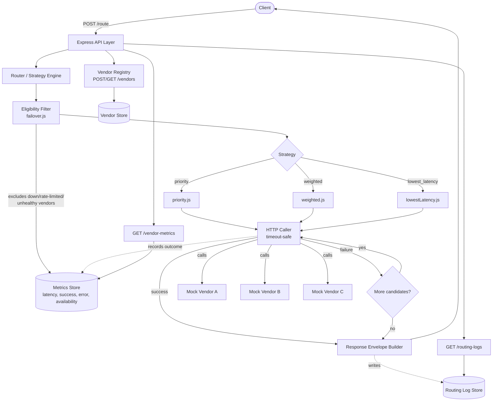

# Intelligent Vendor Routing Platform

A single unified API that sits in front of multiple vendors offering the same capability (e.g. PAN verification, OCR, SMS) and routes each request to the best available vendor — based on configurable strategies (priority / weighted / lowest-latency) and live performance signals (latency, error rate, availability) — with automatic failover when the chosen vendor is down, rate-limited, or underperforming.

The client only ever calls `/route`. It never knows which vendor actually served the request.

## Architecture



## Folder structure

```
vendor-routing-platform/
├── server/
│   ├── index.js                    # entrypoint
│   ├── app.js                      # route wiring
│   ├── models/                     # data layer (in-memory, swappable interface)
│   │   ├── vendorStore.js
│   │   ├── metricsStore.js
│   │   └── routingLogStore.js
│   ├── routes/
│   │   ├── vendors.js              # POST/GET /vendors
│   │   ├── route.js                # POST /route
│   │   ├── metrics.js              # GET /vendor-metrics
│   │   └── logs.js                 # GET /routing-logs
│   ├── mocks/
│   │   └── mockVendors.js          # fake vendors w/ latency & failure injection
│   ├── services/
│   │   ├── router.js               # core orchestration
│   │   └── strategies/
│   │       ├── priority.js
│   │       ├── weighted.js
│   │       ├── lowestLatency.js
│   │       └── failover.js         # eligibility filtering
│   └── utils/
│       ├── httpCaller.js           # timeout-safe vendor calls
│       └── responseEnvelope.js     # standardized output shape
├── sample-configs/
│   ├── vendors.json
│   └── routing-rule.json
├── docs/
│   ├── sample-requests-responses.md
│   └── routing-decisions.md
└── README.md
```

## Setup & Run

Requires a MongoDB instance (local `mongod` or Atlas — both work, just set `MONGODB_URI`).

```bash
npm install
cp .env.example .env
# edit .env and set MONGODB_URI to your local mongod or Atlas connection string
node server/index.js
```
Server starts on `http://localhost:4000` (override with `PORT` in `.env`). If MongoDB is unreachable, the server logs a clear connection error and exits rather than starting in a broken state.

## Quick Demo (reproduces the failover scenario)

```bash
# Register a vendor that will be forced to fail
curl -X POST http://localhost:4000/vendors -H "Content-Type: application/json" -d '{
  "name":"VendorA","capability":"PAN_VERIFICATION",
  "baseUrl":"http://localhost:4000/mock/vendor-a/verify?down=true",
  "weight":70,"priority":1,"costPerRequest":1.5,"timeoutMs":2000,"rateLimitPerMinute":100
}'

# Register a healthy backup vendor
curl -X POST http://localhost:4000/vendors -H "Content-Type: application/json" -d '{
  "name":"VendorB","capability":"PAN_VERIFICATION",
  "baseUrl":"http://localhost:4000/mock/vendor-b/verify",
  "weight":30,"priority":2,"costPerRequest":1.2,"timeoutMs":3000,"rateLimitPerMinute":50
}'

# Route a request -> watch it fail over from A to B automatically
curl -X POST http://localhost:4000/route -H "Content-Type: application/json" -d '{
  "capability":"PAN_VERIFICATION",
  "payload":{"pan":"ABCDE1234F","name":"Rahul Sharma"},
  "strategy":"priority"
}'

# Check metrics and logs reflect what just happened
curl "http://localhost:4000/vendor-metrics?capability=PAN_VERIFICATION"
curl "http://localhost:4000/routing-logs?capability=PAN_VERIFICATION"
```

More examples with real captured output: see [`docs/sample-requests-responses.md`](docs/sample-requests-responses.md).
Design rationale for the routing/failover approach: see [`docs/routing-decisions.md`](docs/routing-decisions.md).

## API Reference

| Method | Path | Description |
|---|---|---|
| `POST` | `/vendors` | Register a vendor for a capability |
| `GET` | `/vendors?capability=` | List vendors, optionally filtered |
| `POST` | `/route` | Route a request to the best available vendor |
| `GET` | `/vendor-metrics?capability=` | Current latency/success/error/availability per vendor |
| `GET` | `/routing-logs?capability=&limit=` | History of routing decisions |
| `GET` | `/health` | Service health |

### `POST /route` request shape
```json
{
  "capability": "PAN_VERIFICATION",
  "payload": { "pan": "ABCDE1234F", "name": "Rahul Sharma" },
  "requirements": { "maxLatencyMs": 2000, "preferLowCost": true },
  "strategy": "weighted",
  "failoverConditions": { "maxLatencyMs": 2000, "maxErrorRate": 0.05 }
}
```

### `POST /route` response shape
```json
{
  "status": "SUCCESS",
  "vendorUsed": "VendorB",
  "routingReason": "VendorB selected because VendorA crossed latency threshold",
  "latencyMs": 850,
  "cost": 1.2,
  "response": { "panStatus": "VALID", "nameMatch": true }
}
```

## Routing Strategies Implemented

1. **`priority`** — always prefers the lowest `priority` number
2. **`weighted`** — probabilistic selection matching configured traffic split (e.g. 70/30)
3. **`lowest_latency`** — prefers whichever vendor currently has the lowest rolling average latency

All three share the same failover mechanism (§ see `docs/routing-decisions.md`): if the selected vendor fails, times out, or is rate-limited, the engine automatically retries the next-best candidate and logs why.

## Design Notes

- **Vendors and routing logs are Mongoose-backed** (`server/models/schemas/Vendor.js`, `RoutingLog.js`). The store layer (`vendorStore.js`, `routingLogStore.js`) kept the exact same method signatures as the original in-memory version — only `await` was added at call sites — so the swap touched no route/service logic beyond that.
- **Metrics remain in-memory, deliberately.** Rolling latency windows and per-minute rate-limit counters are ephemeral, high-frequency data — the textbook Redis use case from the original stack plan. Persisting that to Mongo would add write load for no real benefit; if Redis gets added later, only `metricsStore.js` needs to change.
- **Two-layer failover.** Proactive (exclude known-bad vendors before trying them) + reactive (fail over mid-request if a call that passed the proactive check still fails). See `docs/routing-decisions.md` for the full rationale.
- **Mock vendors support live failure injection** (`?down=true`, `?failRate=0.5`, `?latencyMs=3000`) specifically so failover and lowest-latency routing can be demonstrated live, not just claimed in a README.
- **Fast-fail DB connection.** `serverSelectionTimeoutMS: 5000` on the Mongoose connection means a wrong `MONGODB_URI` surfaces as a clear error in ~5s instead of Mongoose's default 30s hang.

## Tech Stack

- Node.js + Express
- MongoDB (Mongoose) for vendors and routing logs
- In-memory rolling store for live metrics (Redis-ready interface if needed later)
- Axios for vendor calls with per-vendor timeout enforcement